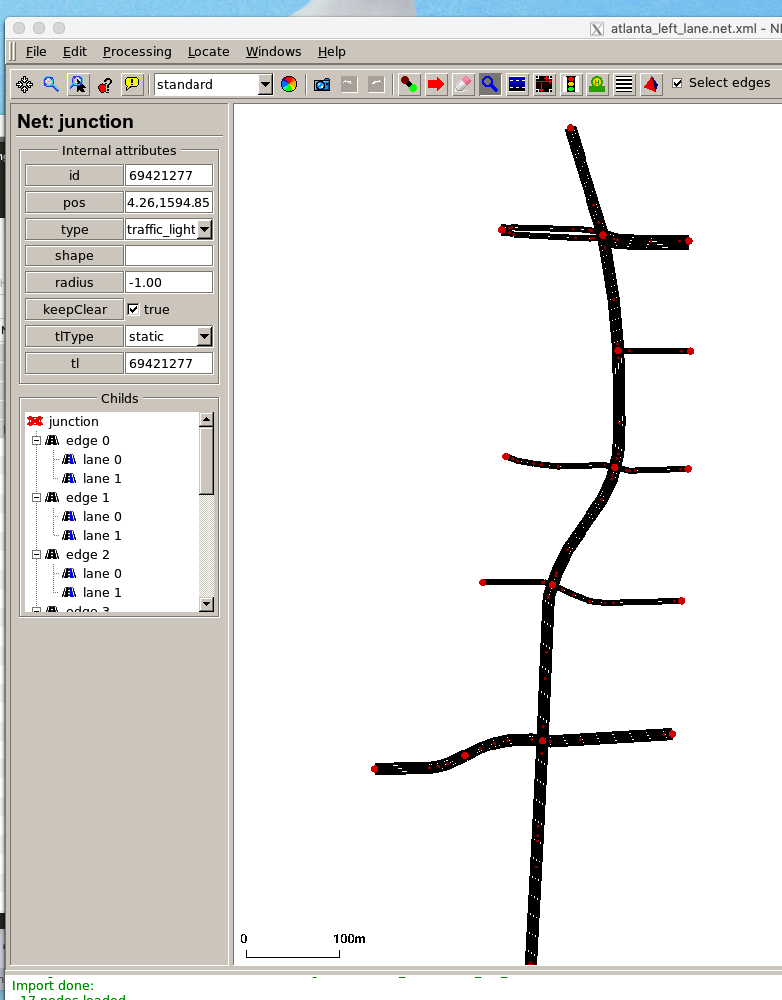
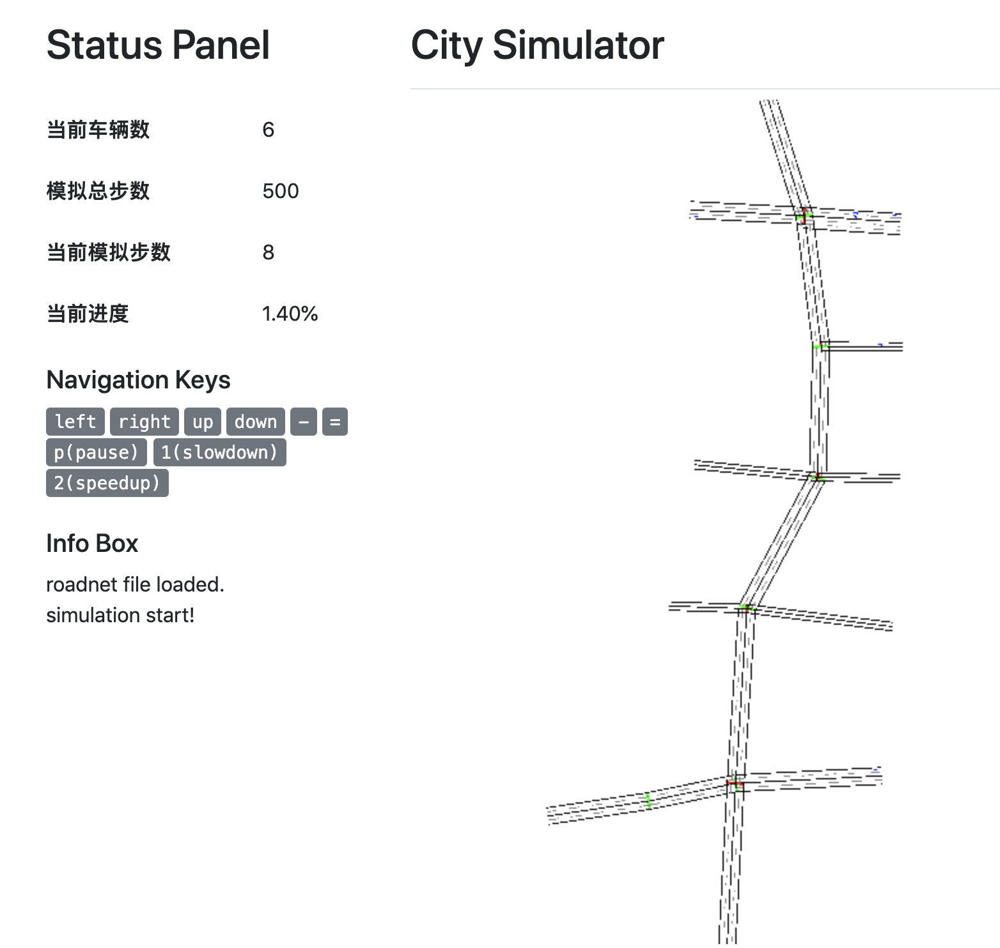

# Converter

Converter.py can convert sumo roadnet files to its corresponding Cityflow version. 

The following code convert a sumo file, atlanta.net.xml, to its cityflow format.

```
python converter.py --sumonet atlanta.net.xml --cityflownet atlanta.json
```
SUMO roadnet




